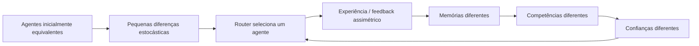
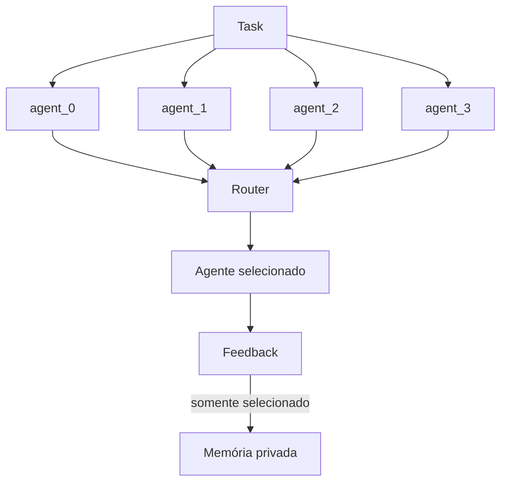

# Da leitura sobre routing à especialização emergente em sociedades de LLMs

> **Status:** apresentação / working note — resultados exploratórios de uma primeira run `private`  
> **Projeto:** Emergent Specialization in Initially Homogeneous LLM Societies  
> **Run discutida neste documento:** `private-seed1-20260806T222033Z-9cd70b19`  
> **Modelo:** DeepSeek V4 Flash via Oh My Pi (OMP)  
> **Objetivo desta versão:** contar a história intelectual do experimento, explicar o desenho e apresentar honestamente o primeiro sinal observado — antes do controle `shared` e de múltiplos seeds.

---

## Como usar este documento na apresentação

Este Markdown foi escrito para funcionar de duas maneiras:

1. **como roteiro de apresentação**, seguindo a narrativa de cima para baixo;
2. **como documentação do projeto**, preservando motivação, desenho experimental, métricas, resultados e cautelas.

Para uma apresentação de aproximadamente **12–15 minutos**, eu seguiria as seções 1–12 e deixaria os apêndices apenas para perguntas.

Para uma apresentação de **5 minutos**, use a seção [Versão curta da história](#versão-curta-da-história).

---

# 1. Isso não era o experimento que eu estava planejando fazer

A história começou de um jeito bastante simples.

Eu estava lendo o paper:

> **When is Routing Meaningful? Diversity and Robustness in Language Model Societies**

porque queria entendê-lo bem o suficiente para apresentá-lo ao grupo.

A pergunta do paper me pareceu interessante porque ele não trata routing apenas como:

> "qual agente dá a melhor resposta?"

Ele tenta perguntar se uma sociedade de modelos possui **estrutura suficiente para que routing seja de fato meaningful**.

Em particular, aparecem duas ideias:

- os atores disponíveis precisam apresentar **diversidade comportamental**;
- as decisões do router precisam ter alguma estrutura e robustez.

Uma das ferramentas usadas para olhar a diversidade comportamental é a **Hierarchic Social Entropy (HSE)**.

Até aí, a direção conceitual é aproximadamente:

```text
sociedade de atores
      ↓
os atores já apresentam diferenças comportamentais
      ↓
medimos essa diversidade
      ↓
o router pode explorar essas diferenças
```

Enquanto eu tentava entender isso, surgiu uma dúvida lateral:

> **Esses agentes precisam ser diferentes desde o começo?**

E, mais especificamente:

> **O que acontece se todos os agentes começarem iguais?**

Foi essa pergunta que mudou o projeto.

---

# 2. A inversão que motivou o experimento

Durante a discussão sobre o paper, apareceu uma possibilidade típica de sistemas complexos:

> componentes inicialmente equivalentes podem terminar funcionalmente diferentes se pequenas assimetrias forem amplificadas pela dinâmica.

Então a pergunta do paper pôde ser invertida.

O paper, de maneira simplificada, pergunta:

> **dada uma sociedade, existe diversidade comportamental suficiente para o routing ser significativo?**

A pergunta que surgiu foi:

> **e se o próprio routing ajudar a criar a diversidade que depois passa a explorar?**

Essa é a ideia central do experimento:

$
\boxed{
\text{routing}
\rightarrow
\text{experiência assimétrica}
\rightarrow
\text{diversidade}
\rightarrow
\text{routing mais estruturado}
}
$

Ou, em inglês, na formulação que acabou resumindo melhor o projeto:

> **The routing mechanism may not merely exploit actor diversity; through asymmetric experience, it may become a generator of the diversity it later exploits.**

---

# 3. A analogia física: quebra de simetria

A inspiração aqui é a linguagem de **symmetry breaking**, mas com bastante cuidado.

Não estou afirmando que:

- existe uma transição de fase;
- existe um parâmetro de ordem rigorosamente estabelecido;
- demonstramos uma teoria geral de emergência em LLMs.

A analogia operacional é mais simples:

$
\text{simetria inicial}
\rightarrow
\text{flutuação}
\rightarrow
\text{feedback}
\rightarrow
\text{assimetria persistente}.
$

A pergunta experimental é:

> **pequenas diferenças estocásticas entre agentes inicialmente exchangeable podem ser amplificadas pelo histórico de interação até produzirem diferenciação funcional persistente?**



A hipótese interessante não é apenas que os agentes passem a responder diferente.

**Randomness já produz diferença.**

O que queremos encontrar é algo mais forte:

> diferença **organizada por função**, útil e potencialmente persistente.

---

# 4. O sistema mínimo

Eu quis construir o sistema mais simples possível em que essa dinâmica pudesse aparecer.

São **quatro agentes**:

```text
agent_0
agent_1
agent_2
agent_3
```

Todos começam com:

- o mesmo modelo;
- o mesmo system prompt;
- as mesmas capacidades;
- a mesma configuração de inferência;
- memória vazia;
- nenhuma persona;
- nenhum papel atribuído;
- nenhum domínio previamente designado.

O ID existe apenas no host Python para logging.

O modelo não recebe:

> "você é o agent_1"

nem:

> "você é o especialista em BETA".

Conceitualmente:

$
r_i(0) \approx r_j(0)
\qquad \forall i,j.
$

A única fonte inicial de diferença comportamental é a própria estocasticidade da inferência.

---

# 5. Por que não usar matemática, física, código ou medicina?

Se eu desse aos agentes tarefas reais de matemática, código, física ou medicina, surgiria um problema:

> o modelo já chega com competências adquiridas no pretraining.

Então, se um agente terminasse melhor em matemática, seria difícil saber se:

1. ele se especializou durante o experimento; ou
2. estamos apenas vendo alguma diferença contingente do modelo em um domínio que ele já conhecia.

Por isso o ambiente é composto por **quatro micro-mundos sintéticos**:

- `ALPHA`
- `BETA`
- `GAMMA`
- `DELTA`

Cada mundo possui uma regra modular escondida:

$
f_k(x,y)=(a_kx+b_ky+c_k)\bmod 7.
$

As regras têm a mesma estrutura geral, mas coeficientes diferentes.

Exemplo:

```text
World ALPHA

x = 3
y = 5

Qual é a saída?

0 1 2 3 4 5 6
```

O ambiente sabe a resposta correta.

O agente não recebe a regra.

Para ficar competente, ele precisa **inferir a regularidade a partir das experiências que recebe durante a execução**.

Isso é importante porque torna a competência uma propriedade adquirida **dentro da dinâmica experimental**.

---

# 6. Uma rodada

A cada round:

1. escolhemos um mundo;
2. amostramos \(x\) e \(y\);
3. enviamos **a mesma tarefa para os quatro agentes**;
4. cada um responde com:
   - `answer`;
   - `confidence`;
5. o router escolhe o agente com maior confidence;
6. o ambiente avalia a resposta selecionada;
7. distribuímos feedback;
8. atualizamos a memória experimental;
9. registramos tudo.

O output de um agente tem a forma:

```json
{
  "answer": 4,
  "confidence": 0.73
}
```

O routing baseline é:

$
R_t=\arg\max_i c_i(q_t).
$

Não estamos tratando `confidence` como uma probabilidade calibrada.

Ela é apenas parte do **mecanismo de interação**.

---

# 7. A dinâmica que pode amplificar diferenças

Imagine que, por acaso, `agent_1` fique um pouco mais confiante em uma tarefa BETA.

Ele é selecionado.

Na condição privada, só ele recebe a experiência.

Na próxima tarefa BETA:

- `agent_1` já viu uma observação daquele mundo;
- os outros talvez não tenham visto nenhuma.

Se isso aumenta sua competência e sua confiança, ele pode ser selecionado novamente.

Então surge o ciclo:

$
\boxed{
\text{experiência}
\rightarrow
\text{competência}
\rightarrow
\text{confiança}
\rightarrow
\text{seleção}
\rightarrow
\text{mais experiência}
}
$

Esse feedback loop é o mecanismo candidato para amplificar uma diferença microscópica.

---

# 8. `private` versus `shared`

Essa é a comparação causal central.

## Private memory

Somente o agente selecionado recebe o feedback.



Assim:

$
m_i(t)\neq m_j(t)
$

pode surgir.

## Shared memory

O agente selecionado determina a resposta que recebe feedback, mas essa experiência é copiada para todos:

```text
               feedback
                  │
        ┌─────────┼─────────┐
        ▼         ▼         ▼         ▼
     agent_0   agent_1   agent_2   agent_3
```

A intenção é manter os históricos informacionais muito mais semelhantes.

Portanto:

> se a assimetria de memória realmente for o mecanismo de especialização, esperamos observar uma diferenciação mais forte em `private` do que em `shared`.

**Neste documento, porém, ainda estamos olhando apenas uma primeira run `private`.**

O controle `shared` é o próximo passo necessário.

---

# 9. Como medir "especialização"?

"Os agentes ficaram diferentes" é uma frase insuficiente.

Por isso o experimento separa quatro perguntas.

---

## 9.1 HSE — os comportamentos ficaram diferentes?

Nos checkpoints, congelamos a sociedade e damos aos quatro agentes o mesmo conjunto de 40 probes.

Cada agente produz um vetor binário:

$
b_i=(1,0,0,1,\ldots)
$

indicando quais probes ele acertou.

A HSE resume a estrutura hierárquica das distâncias entre esses perfis.

Intuição:

- HSE baixa: os agentes tendem a acertar e errar as mesmas coisas;
- HSE alta: os agentes apresentam success/failure profiles diferentes.

Mas:

$
\boxed{\text{HSE alta} \not\Rightarrow \text{especialização útil}}
$

Randomness também pode produzir vetores comportamentais diferentes.

---

## 9.2 Mutual information — a diferença está organizada por tarefa?

Definimos:

$
C=\text{mundo da tarefa}
$

e

$
R=\text{agente selecionado}.
$

Então medimos:

$
I(C;R).
$

A pergunta intuitiva é:

> **se eu souber que a tarefa veio de BETA, isso me ajuda a prever qual agente será selecionado?**

Se não:

$
I(C;R)\approx0.
$

Se certos mundos passam a ser consistentemente associados a determinados agentes:

$
I(C;R)>0.
$

Isso é muito mais próximo de **divisão de trabalho**.

---

## 9.3 Utilization entropy — ou simplesmente um agente ganhou tudo?

Um sistema assim:

```text
agent_1
agent_1
agent_1
agent_1
agent_1
...
```

não é uma sociedade especializada.

É routing collapse.

Por isso medimos a entropia de utilização:

$
H(R)
=
-\sum_i p(R=i)\log_2 p(R=i).
$

A versão normalizada vai de aproximadamente:

- \(0\): monopólio;
- \(1\): utilização perfeitamente uniforme.

---

## 9.4 Oracle gain — as diferenças são úteis?

No probe set, medimos:

$
A_{\mathrm{best}}
=
\text{accuracy do melhor agente individual}.
$

Depois imaginamos um oracle que, para cada probe, pudesse escolher retrospectivamente qualquer agente que soubesse resolvê-lo:

$
A_{\mathrm{oracle}}.
$

Então:

$
\Delta_{\mathrm{comp}}
=
A_{\mathrm{oracle}}
-
A_{\mathrm{best}}.
$

Se esse valor for alto, diferentes agentes possuem competências **complementares**.

---

# 10. A primeira run real

A primeira run científica exploratória foi:

```text
run:
private-seed1-20260806T222033Z-9cd70b19

condition: private
model: DeepSeek V4 Flash
backend: OMP RPC
agents: 4
rounds: 20
checkpoints: [0, 20]
probe set: 40 tasks
seed: 1
```

Controles técnicos relevantes:

- mesmo system prompt para todos;
- memórias inicialmente vazias;
- IDs dos agentes apenas no host;
- regras escondidas fora do prompt;
- probes não modificam memória;
- uma sessão OMP nova com `--no-session` por completion;
- tools, skills, rules, LSP e outras capacidades desligadas para o baseline;
- memória científica controlada explicitamente pelo Python.

A run terminou com status `completed`.

---

# 11. Primeiro resultado: o routing ficou estruturado por mundo

Depois de somente 20 rounds, a matriz de routing observada foi:

| Mundo | agent_0 | agent_1 | agent_2 | agent_3 |
|---|---:|---:|---:|---:|
| **ALPHA** | 1 | 1 | 0 | **3** |
| **BETA** | 0 | **4** | 0 | 0 |
| **GAMMA** | 1 | 0 | **2** | 0 |
| **DELTA** | 0 | **7** | 0 | 1 |

Em outras palavras:

```text
ALPHA → majoritariamente agent_3
BETA  → 4/4 agent_1
GAMMA → 2/3 agent_2
DELTA → 7/8 agent_1
```

Isso chama atenção porque **nenhum desses papéis foi especificado previamente**.

O resultado agregado de seleção foi:

```text
agent_0:  2
agent_1: 12
agent_2:  2
agent_3:  4
```

Então existe concentração em `agent_1`.

Mas ela não é simplesmente:

> `agent_1` ganha qualquer tarefa.

Ela possui forte estrutura por domínio:

- praticamente todo BETA foi para `agent_1`;
- praticamente todo DELTA foi para `agent_1`;
- ALPHA foi majoritariamente para `agent_3`;
- GAMMA não foi para `agent_1`.

A **entropia normalizada de utilização** foi:

$
H_{\mathrm{util,norm}}=0.7855.
$

Portanto, existe concentração, mas não um monopólio trivial de um único agente.

---

# 12. Segundo resultado: parte do routing coincidiu com competência

No checkpoint final, a matriz de competência nos 40 probes foi:

| Agente | ALPHA | BETA | GAMMA | DELTA |
|---|---:|---:|---:|---:|
| `agent_0` | 10% | 10% | 10% | 20% |
| **`agent_1`** | 0% | **100%** | 20% | **90%** |
| `agent_2` | 30% | 20% | 0% | 40% |
| **`agent_3`** | **60%** | 10% | 10% | 30% |

A correspondência mais clara é:

```text
BETA
  routing → agent_1 em 4/4
  competence → agent_1 = 100%

DELTA
  routing → agent_1 em 7/8
  competence → agent_1 = 90%

ALPHA
  routing → agent_3 em 3/5
  competence → agent_3 = 60%
```

Isso é exatamente o tipo de padrão que a hipótese procurava:

$
\text{experiência diferenciada}
\rightarrow
\text{competência diferenciada}
\rightarrow
\text{routing dependente da tarefa}.
$

---

# 13. GAMMA é o contraexemplo importante

O resultado não é perfeitamente "bonito".

E isso é bom.

Para GAMMA:

```text
routing:
agent_2 em 2/3 rounds
```

mas no probe final:

```text
accuracy de agent_2 em GAMMA = 0%
```

Ou seja:

$
\boxed{
\text{routing estruturado}
\neq
\text{especialização competente}
}
$

Isso mostra por que `task-agent MI` sozinho não pode ser interpretado como "o sistema aprendeu uma divisão de trabalho útil".

O router pode formar associações estáveis ou recorrentes que são **ruins**.

É justamente por isso que precisamos de várias métricas.

---

# 14. Os números agregados da primeira run

No checkpoint final:

| Métrica | Valor |
|---|---:|
| Normalized HSE | **0.6661** |
| Normalized task-agent MI | **0.4586** |
| Normalized utilization entropy | **0.7855** |
| Melhor accuracy individual | **52.5%** |
| Oracle society accuracy | **75.0%** |
| Oracle gain | **22.5 p.p.** |
| Temporal role stability | **0.275** |

A tradução qualitativa desses números é:

### `HSE_norm = 0.666`

Os agentes terminaram com perfis comportamentais bastante distintos no probe set.

### `MI_norm = 0.459`

O mundo da tarefa passou a carregar uma quantidade substancial de informação sobre qual agente era selecionado.

### `H_util = 0.785`

A sociedade não estava perfeitamente balanceada, mas também não sofreu um colapso completo para um único agente.

### `best = 52.5%`, `oracle = 75%`

Há competências complementares:

$
75\%-52.5\%=22.5\text{ p.p.}
$

Um oracle capaz de escolher o agente certo para cada probe cobriria significativamente mais tarefas que o melhor indivíduo isolado.

---

# 15. O que esse resultado parece mostrar

A leitura mais interessante desta única trajetória é:

> agentes inicialmente homogêneos acumularam histórias privadas diferentes, e em apenas 20 interações surgiu uma estrutura parcial em que certos mundos passaram a ser associados a determinados agentes e, em alguns desses mundos, essa associação coincidiu com competências muito diferentes no probe set.

Em forma esquemática:

```text
same model
same prompt
empty memory
     │
     ▼
stochastic differences
     │
     ▼
confidence routing
     │
     ▼
private feedback
     │
     ▼
different histories
     │
     ▼
different competence
     │
     ▼
task-dependent routing
```

A observação mais forte não é:

> "os agentes ficaram diferentes".

É:

> **parte das diferenças passou a estar organizada de acordo com a tarefa e alinhada com competência adquirida.**

Isso é muito mais próximo de especialização funcional.

---

# 16. O que esse resultado NÃO demonstra

Este ponto precisa ser dito explicitamente na apresentação.

Ainda temos:

- **uma única seed**;
- apenas **20 rounds**;
- apenas a condição **private** desta primeira execução;
- inferências de LLM naturalmente estocásticas;
- alguns retries técnicos;
- um bug de parsing identificado e corrigido antes do par experimental definitivo;
- nenhum teste estatístico entre condições ainda.

Portanto, eu **não** diria:

> "demonstramos emergent specialization".

Muito menos:

> "demonstramos symmetry breaking em sociedades de LLMs".

A formulação correta, por enquanto, é algo como:

> **Nesta primeira trajetória exploratória, observamos um estado qualitativamente consistente com diferenciação funcional emergente: houve estrutura task-dependent no routing, diferenciação de competência e complementaridade, apesar da ausência de papéis atribuídos inicialmente.**

Mas ainda falta responder:

> **isso apareceu por causa da memória privada ou poderia aparecer simplesmente por stochasticity e pela dinâmica do router?**

É exatamente para isso que existe o controle `shared`.

---

# 17. Por que HSE sozinha não basta

Esse experimento também ajuda a deixar clara uma distinção conceitual importante:

$
\boxed{
\text{diversidade} \neq \text{especialização}
}
$

Mesmo agentes inicialmente idênticos podem responder diferente por stochastic decoding.

Então um valor alto de HSE pode refletir:

- especialização;
- ruído;
- respostas aleatórias;
- trajetórias independentes sem estrutura funcional.

Por isso a leitura precisa combinar:

$
\text{HSE}
$

com:

$
I(C;R)
$

e:

$
\Delta_{\mathrm{comp}}.
$

Uma frase útil para apresentar:

> **Randomness gives us diversity almost for free. The interesting question is whether the diversity becomes organized, useful and persistent.**

Em português:

> **Randomness gera diversidade quase de graça. O difícil é produzir diversidade organizada, útil e persistente.**

---

# 18. As quatro perguntas que as métricas respondem

Essa é talvez a síntese conceitual mais útil do projeto:

> **Diversidade diz que os agentes diferem.**  
> **Mutual information diz que essa diferença está organizada.**  
> **Complementaridade diz que essa organização é útil.**  
> **Robustez e estabilidade dizem se a organização persiste.**

Em forma de tabela:

| Pergunta | Métrica |
|---|---|
| Os agentes ficaram comportamentalmente diferentes? | HSE |
| A diferença está organizada segundo a tarefa? | \(I(C;R)\) |
| O sistema colapsou em um agente? | Utilization entropy |
| Diferentes agentes sabem coisas diferentes e úteis? | Oracle gain |
| Os papéis persistem? | Temporal stability |
| O routing é semanticamente robusto? | Routing robustness |

---

# 19. A conclusão honesta da primeira run

Se eu tivesse que resumir o resultado atual em uma frase para o grupo:

> **Eu ainda não demonstrei emergent specialization, mas produzi uma primeira trajetória em que agentes inicialmente homogêneos desenvolveram histórias privadas diferentes e terminaram apresentando routing task-dependent, competências diferentes por domínio e complementaridade — exatamente o tipo de estado symmetry-broken que o experimento foi desenhado para procurar.**

Ou, ainda mais curto:

> **O fenômeno apareceu como sinal. Agora falta descobrir se ele sobrevive ao controle.**

---

# 20. O teste que realmente importa agora

O próximo passo é produzir um par comparável:

```text
              mesmo commit
              mesmo modelo
              mesmo seed
              mesmo probe set
              mesmo router
              mesmo número de rounds
                    │
            ┌───────┴───────┐
            ▼               ▼
         PRIVATE          SHARED
            │               │
 feedback só para       feedback para
 o selecionado          todos os agentes
```

Se a interpretação estiver correta, esperamos algo como:

$
\mathrm{HSE}_{private}
>
\mathrm{HSE}_{shared},
$

$
I_{private}(C;R)
>
I_{shared}(C;R),
$

e possivelmente:

$
\Delta_{\mathrm{comp,private}}
>
\Delta_{\mathrm{comp,shared}}.
$

Mas essas são **hipóteses**, não resultados.

Depois será necessário repetir em múltiplos seeds.

---

# 21. O resultado positivo mais interessante possível

O cenário mais convincente seria observar:

```text
PRIVATE

ALPHA → agent_A
BETA  → agent_B
GAMMA → agent_C
DELTA → agent_D

alta diferenciação de competência
routing dependente da tarefa
boa complementaridade
```

enquanto:

```text
SHARED

todos recebem aproximadamente a mesma informação
        ↓
competências permanecem semelhantes
        ↓
routing menos task-dependent
        ↓
menor diferenciação funcional
```

A interpretação então seria:

> **a assimetria informacional criada pelo routing é suficiente para amplificar diferenças microscópicas e gerar especialização funcional.**

---

# 22. E se o controle não confirmar?

Também seria um resultado interessante.

Se `shared` produzir diferenciação semelhante a `private`, então a explicação:

> "histórias privadas causam especialização"

fica enfraquecida.

Teríamos que considerar:

- stochastic decoding;
- confidence-induced lock-in;
- path dependence do router;
- outras assimetrias do runtime;
- insuficiência da manipulação experimental.

Se ambos permanecerem sem estrutura em outros seeds, esta primeira run pode ter sido apenas uma trajetória particularmente favorável.

Isso é justamente por que o controle e as replicações importam.

---

# 23. A ponte de volta para o paper

O paper que motivou essa história olha para diversidade como uma propriedade relevante da sociedade que o router encontra.

O experimento sugere uma extensão dinâmica:

$
B
\rightarrow
B(t).
$

Em vez de perguntar apenas:

> "qual é a diversidade comportamental desta sociedade?"

podemos perguntar:

> "como essa diversidade foi produzida?"

e:

> "como ela evolui ao longo da interação?"

A hipótese mais interessante é:

$
\boxed{
\text{actor diversity may be an endogenous dynamical variable}
}
$

Ou seja:

> a diversidade dos atores pode não ser apenas uma condição de entrada para routing; pode ser também um **output da própria dinâmica de routing**.

---

# 24. Onde isso pode ir depois

Se o efeito sobreviver a `private vs shared` e a múltiplos seeds, algumas extensões naturais são:

## Feedback privacy como parâmetro de controle

$
p_{\mathrm{private}}\in[0,1].
$

Varrer:

$
0,\;0.25,\;0.5,\;0.75,\;1.
$

e observar:

- HSE;
- MI;
- complementarity;
- stability.

Isso pode revelar diferentes **regimes de organização**.

---

## Tamanho da população

$
N\in\{2,4,8,16\}.
$

Perguntas:

- mais agentes aumentam diversidade?
- há pouca experiência por agente quando \(N\) cresce?
- complementaridade satura?

---

## Topologia de comunicação

Colocar agentes em:

- complete graph;
- ring;
- random graph;
- modular graph;
- scale-free graph.

E perguntar:

> **como a topologia de fluxo de informação afeta a diferenciação?**

---

## Informação coletiva

Ir além de:

$
I(C;R)
$

para estudar:

- redundancy;
- unique information;
- synergy;
- Partial Information Decomposition;
- O-information;
- information flow.

A pergunta deixa de ser apenas:

> "quem se especializou em quê?"

e passa a ser:

> **que informação existe no coletivo que não pode ser atribuída trivialmente a um componente individual?**

---

# 25. Uma extensão que surgiu depois: prever o destino da sociedade cedo

Se cada sociedade produz uma trajetória macroscópica:

$
z(t)
=
[
\mathrm{HSE}(t),
I(C;R)(t),
H_{\mathrm{util}}(t),
\Delta_{\mathrm{comp}}(t),
\ldots
],
$

podemos perguntar:

> **a trajetória inicial contém informação sobre o regime final?**

Por exemplo:

$
p(Y_T\mid \theta,z_{0:\tau}),
\qquad
\tau\ll T.
$

Isso permitiria:

```text
rodar muitas configurações por pouco tempo
              ↓
observar trajetórias iniciais
              ↓
prever quais parecem caminhar para bons regimes
              ↓
matar runs ruins cedo
              ↓
alocar compute às promissoras
```

Isso aproxima o problema de:

- learning-curve extrapolation;
- multi-fidelity optimization;
- automated design of multi-agent systems;
- eventualmente controle adaptativo da sociedade.

Essa é uma direção futura, não parte do baseline atual.

---

# 26. Fechamento

Eu fecharia a apresentação voltando à pergunta que surgiu durante a leitura.

O ponto de partida era:

> **When is routing meaningful?**

A pergunta lateral virou:

> **What if meaningful diversity is itself created by routing?**

E o experimento mínimo se tornou:

$
\boxed{
\text{agentes idênticos}
+
\text{routing}
+
\text{experiência privada}
+
\text{feedback}
\rightarrow
\text{possível diferenciação funcional}
}
$

O primeiro run não prova a hipótese.

Mas ele mostrou algo suficientemente estruturado para justificar continuar:

- routing dependente do mundo;
- competência por domínio parcialmente alinhada ao routing;
- diversidade comportamental;
- ausência de collapse total;
- complementaridade relevante.

A próxima pergunta já está bem definida:

> **o mesmo padrão continua aparecendo quando isolamos causalmente a assimetria de memória e repetimos em outras seeds?**

---

# 27. Frase final

> **Talvez diversidade de atores não seja apenas uma propriedade que o router precisa encontrar. Talvez, em uma sociedade adaptativa, ela seja uma propriedade que o próprio routing ajuda a produzir.**

---

# Versão curta da história

Se houver apenas alguns minutos para apresentar:

```text
Eu estava lendo um paper sobre quando routing é meaningful.
                         ↓
O paper mede diversidade entre atores.
                         ↓
Surgiu uma pergunta:
"eles precisam começar diferentes?"
                         ↓
Construí quatro cópias do mesmo DeepSeek.
Sem roles. Mesmo prompt. Memória vazia.
                         ↓
Criei quatro hidden worlds sintéticos.
                         ↓
Todos respondem a cada task.
O mais confiante é selecionado.
                         ↓
Na condição PRIVATE,
só o selecionado aprende com o feedback.
                         ↓
Isso cria:
experiência → competência → confiança
        ↑                    ↓
        └──── seleção ←──────┘
                         ↓
Depois de 20 rounds:

BETA  → agent_1 em 4/4 → 100% nos probes
DELTA → agent_1 em 7/8 →  90% nos probes
ALPHA → agent_3 em 3/5 →  60% nos probes

HSE_norm       = 0.666
MI_norm        = 0.459
Util entropy   = 0.785
Best agent     = 52.5%
Oracle society = 75%
                         ↓
Isso parece diferenciação funcional organizada,
mas ainda é UMA seed e SEM shared control.
                         ↓
Próximo passo:
matched PRIVATE vs SHARED + múltiplos seeds.
```

Headline provisória:

> **Routing pode não apenas explorar diversidade; pode participar da criação da diversidade que depois explora.**

---

# Apêndice A — dados da run apresentada

## Identificação

```text
run_id:
private-seed1-20260806T222033Z-9cd70b19

condition:
private

seed:
1

git commit:
29fe3839b5e496adf66a9dcfa4b59c4450026832

model:
deepseek/deepseek-v4-flash

OMP:
17.2.10

thinking:
off

rounds:
20

agents:
4

checkpoints:
0, 20

probe count:
40

probe set hash:
cb234422389ff7d5a04566112a483f147e4a3d1212b1c69fbb0396ec9ca4c55e
```

## Routing counts

```text
agent_0:  2
agent_1: 12
agent_2:  2
agent_3:  4
```

## Memory counts

Como a condição é `private`, o número de experiências recebidas acompanha as seleções:

```text
agent_0:  2
agent_1: 12
agent_2:  2
agent_3:  4
```

## Métricas finais

```text
normalized utilization entropy: 0.785475
normalized task-agent MI:       0.458603
normalized HSE:                 0.666124
best individual accuracy:       0.525
oracle society accuracy:        0.750
oracle gain:                    0.225
temporal role stability:        0.275
```

---

# Apêndice B — matriz de routing

| Mundo | agent_0 | agent_1 | agent_2 | agent_3 |
|---|---:|---:|---:|---:|
| ALPHA | 1 | 1 | 0 | **3** |
| BETA | 0 | **4** | 0 | 0 |
| GAMMA | 1 | 0 | **2** | 0 |
| DELTA | 0 | **7** | 0 | 1 |

---

# Apêndice C — matriz de competência final

| Agente | ALPHA | BETA | GAMMA | DELTA |
|---|---:|---:|---:|---:|
| agent_0 | 0.10 | 0.10 | 0.10 | 0.20 |
| agent_1 | 0.00 | **1.00** | 0.20 | **0.90** |
| agent_2 | 0.30 | 0.20 | 0.00 | 0.40 |
| agent_3 | **0.60** | 0.10 | 0.10 | 0.30 |

---

# Apêndice D — HSE

Para cada agente:

$
b_i=
(s(r_i,e_1),\ldots,s(r_i,e_L)).
$

Distância comportamental:

$
d_{ij}
=
1-
\frac{b_i^\top b_j}
{\|b_i\|_2\|b_j\|_2}.
$

Após single-linkage clustering, para uma partição \(\mathcal C(h)\):

$
H(h)
=
-\sum_k p_k(h)\log_2p_k(h).
$

Então:

$
\operatorname{HSE}
=
\int H(h)\,dh.
$

Normalização usada:

$
\operatorname{HSE}_{norm}
=
\frac{\operatorname{HSE}}{\log_2N}.
$

Para esta run:

$
\operatorname{HSE}_{norm}
=
0.6661.
$

---

# Apêndice E — Mutual information

Definindo:

$
C=\text{world},
\qquad
R=\text{selected agent},
$

temos:

$
I(C;R)
=
\sum_{c,r}
p(c,r)
\log_2
\frac{p(c,r)}
{p(c)p(r)}.
$

A versão normalizada observada foi:

$
I_{norm}(C;R)=0.4586.
$

Interpretação:

> o domínio da tarefa contém informação substancial sobre a identidade do agente selecionado.

Mas GAMMA mostra por que isso **não é suficiente** para concluir competência útil.

---

# Apêndice F — Complementaridade

Melhor indivíduo:

$
A_{\mathrm{best}}=0.525.
$

Oracle society:

$
A_{\mathrm{oracle}}=0.750.
$

Logo:

$
\Delta_{\mathrm{comp}}
=
0.750-0.525
=
0.225.
$

Ou:

$
22.5 \text{ pontos percentuais}.
$

---

# Apêndice G — caveats técnicos desta primeira run

Esta run é útil como exploração, mas não é a run definitiva do matched pair.

Foram observados:

- `407` model calls para `400` completions nominais;
- retries técnicos;
- cobertura de usage de aproximadamente `99%`;
- uma fragilidade de parsing quando a resposta continha chaves em prosa antes do JSON final;
- o parser foi identificado como ponto a corrigir antes do rerun pareado;
- o OMP 17.2.10 apresentou um frame de UI ligado a `autoresearch` em smoke mesmo com extensions desabilitadas; como tools estavam desligadas, não há evidência aqui de que isso tenha afetado a dinâmica, mas o harness deve continuar sendo auditado.

Esses pontos não justificam interpretar esta run como evidência definitiva.

Por isso o plano é:

```text
corrigir parser
      ↓
congelar commit
      ↓
rerun PRIVATE seed 1
      ↓
run SHARED seed 1
      ↓
comparar
      ↓
múltiplos seeds
```

---

# Apêndice H — padrão de interpretação para os próximos resultados

| Observação | Interpretação |
|---|---|
| HSE ↑, MI ↑, complementarity ↑ | forte candidato a diferenciação funcional útil |
| HSE ↑, MI ≈ 0 | diversidade sem organização funcional |
| HSE ↑, complementarity ≈ 0 | comportamento diferente, pouco ganho coletivo |
| MI ↑, utilization entropy ↓ | possível routing collapse |
| MI ↑, competence alignment ↑ | divisão de trabalho mais convincente |
| Private ≫ Shared | evidência a favor de histórias assimétricas como mecanismo |
| Private ≈ Shared | efeito pode não depender da memória privada |
| Alta variação entre seeds | estado symmetry-broken possivelmente contingente / path-dependent |
| Todos os efeitos desaparecem | primeira run provavelmente foi uma trajetória atípica |

---

# Referência conceitual principal

> Huot, Kaisers, Lapata (2026).  
> **When is Routing Meaningful? Diversity and Robustness in Language Model Societies.**

Este projeto **não é uma reprodução** do paper.

É uma extensão dinâmica inspirada pela pergunta:

> se diversidade comportamental torna routing meaningful, **a própria dinâmica de routing pode produzir essa diversidade?**
