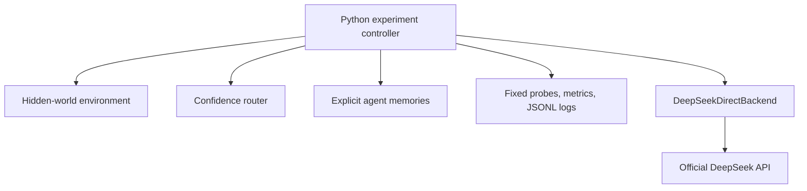

# Emergent Specialization

This repository is a controlled pilot for a narrow question: can initially
homogeneous LLM agents develop persistent, useful task differentiation solely
from asymmetric feedback histories? The complete scientific design, controls,
and methodological cautions are in [Emergent Specialization.md](Emergent%20Specialization.md).

## Current research status

This is active MSc research, not a finished benchmark. The current evidence is
deliberately layered:

- **Local plasticity:** qualified as a microscopic niche-specific competence
  gate.
- **Social amplification:** supported in the repaired Minimal Developmental
  Society V1 analysis.
- **Functional organization:** partial; competence interaction and aligned
  routing were observed, but the preregistered realized team-utility gate
  failed.
- **Emergent functional specialization:** not yet supported.

The repaired analysis is the canonical society result:
[MINIMAL_DEVELOPMENTAL_SOCIETY_V1_ANALYSIS_REPAIR_REPORT.md](docs/MINIMAL_DEVELOPMENTAL_SOCIETY_V1_ANALYSIS_REPAIR_REPORT.md).
The initial report is retained with a `SUPERSEDED` notice for provenance.

Theory V1 is now frozen as a prospective challenge, not a result. Its offline
equations, epistemic ledger, deterministic manifests, and mock validation are
under `src/emergent_specialization/theory_v1/` and `docs/theory/`. The fixed
design plans 212,480 logical completions; the preflight currently blocks paid
execution because the required safety-margin forecast exceeds its US$6.25 cap.

For navigation, see the [documentation map](docs/README.md), the
[experiment registry](docs/EXPERIMENT_REGISTRY.md), and the
[artifact index](docs/ARTIFACT_INDEX.md). Large handoff packages are preserved
locally under `.artifacts/packages/` and are indexed by SHA-256 rather than
tracked in Git.



Codex is the development agent for this repository; it is not an experimental
agent. New replication runs use the official DeepSeek API through one
long-lived OpenAI-compatible client. Python owns identities, sampling, hidden
rules, routing, feedback, memory, checkpoints, random seeds, and all
measurements. OMP remains a legacy/historical adapter for reading and auditing
the exploratory pilots; it is not the primary replication backend.

## Setup

Requires Python 3.11+ and [uv](https://docs.astral.sh/uv/).

```bash
uv sync
```

`uv sync` creates/updates the project environment and lockfile. No manual
`.venv` activation is needed; prefix project commands with `uv run`.

Install the optional notebook/report stack when you want visual analysis:

```bash
uv sync --group report
```

The requested model ID is declared in every real-run config. The harness never
silently substitutes another model. Direct replication credentials are kept in
macOS Keychain through `keyring`; they are not read from `.env`, shell startup
files, YAML, or command-line arguments.

## Run and test

Para não precisar memorizar a cadeia de launcher, `uv` e módulos Python, use
os atalhos do `Makefile`:

```bash
make help
make test
make smoke-dry
make smoke-real
make pilot-private
make report RUN=data/runs/<run-id>
```

Os alvos antigos `pilot-private`/`pilot-shared` são preservados para reproduzir
os pilotos OMP históricos. A primeira nova réplica deve usar os configs em
`configs/research/` e a API direta, com confirmação explícita:

```bash
make pilot-shared CONFIRM=YES
```

Os atalhos que fazem inferência real continuam explicitamente marcados; `make
test` e `make smoke-dry` não fazem chamadas de modelo.

Run the automated test suite (it never contacts DeepSeek):

```bash
uv run python -m unittest discover -s tests -v
```

Run the complete loop with the deterministic fake backend, without any model
calls:

```bash
uv run python -m emergent_specialization.experiment --config configs/pilot_private.yaml --dry-run
```

For a no-call local validation, run the deterministic fake backend:

```bash
uv run python -m emergent_specialization.experiment --config configs/pilot_private.yaml --dry-run
```

The original matched private/shared pair and the later Minimal Developmental
Society V1 campaign are preserved as historical runs. The current canonical
society conclusion comes from an offline repair of the latter; no new run is
implied by installing this repository. See [the pair protocol](docs/FIRST_REAL_PAIR_PROTOCOL.md),
[the repair report](docs/MINIMAL_DEVELOPMENTAL_SOCIETY_V1_ANALYSIS_REPAIR_REPORT.md),
and the [experiment registry](docs/EXPERIMENT_REGISTRY.md) for provenance.

The new replication configs make **560 nominal** DeepSeek completions each: 80
interaction calls plus 160 probe calls at each of checkpoints 0, 10, and 20.
They have a hard ceiling of 700 physical attempts and a declarative USD 0.50
per-run cost guard. They are intentionally not launched automatically.

Real runs print an experiment plan, live completion counts for each probe
checkpoint, and a progress line before each interaction round. The progress
display is terminal-only and does not change prompts, scheduling semantics,
random seeds, or the raw JSONL record. A quiet terminal during checkpoint
evaluation is therefore replaced by a visible `completed/total completions`
counter.

Use `--num-rounds 10` and `--seed 2` for non-persistent overrides.

### Direct DeepSeek API and secure credentials

The new backend reads the API key once from macOS Keychain and keeps it only in
the Python process memory. Register/check/delete it with:

```bash
uv run python -m emergent_specialization.credentials store
uv run python -m emergent_specialization.credentials status
uv run python -m emergent_specialization.credentials delete
```

Offline direct validation (no model call, no Keychain lookup) is:

```bash
uv run python -m emergent_specialization.deepseek_doctor
uv run python -m emergent_specialization.benchmark.deepseek \
  --concurrency 4,8,16,32 --jobs-per-level 32
```

The opt-in real doctor and benchmark require `--confirm-real`; neither changes
scientific state. The old Bitwarden launcher and OMP smoke remain available for
historical compatibility, but should not be used for the new replication pair.

## Experimental controls

- Four agents begin with an identical model ID, system prompt, decoding intent,
  empty memory, and tool access. Agent IDs live only in Python and are not
  inserted into model prompts.
- The four modular rules are environment-only. Prompts provide only an opaque
  world label, `x`, `y`, and answer choices.
- Direct completions use a stateless request containing the system prompt,
  Python-controlled memory, and current task on every call. The historical OMP
  adapter still starts restricted `--mode rpc --no-session` processes and keeps
  its isolation metadata, so old artifacts remain auditable.
- The only model-visible history is an explicit list of selected feedback
  experiences. The baseline uses `recent_k: 8`, giving every agent the same
  context budget. Probe evaluation receives frozen snapshots and cannot update
  memory.
- The direct V4 request explicitly sets JSON Output, `stream=false`, and
  `thinking=disabled`; SDK retries are disabled and retries are owned by the
  runtime. The provider does not expose a documented sampling seed for this
  model, which is recorded as unavailable in metadata.

## Outputs

Each run creates `data/runs/<run-id>/` containing:

- `metadata.json`: config, hashes, runtime and backend metadata;
- `events.jsonl`: every inference attempt, parse failure/retry, round, and
  checkpoint event;
- `metrics.jsonl`: checkpoint behavioral matrices and derived metrics;
- `summary.json`: final routing, memory counts, metrics, and token/cost
  accounting when the provider exposes usage.

### Token usage and cost accounting

The direct adapter records provider usage, cache hit/miss fields, provider IDs,
system fingerprint, latency, retry category, and local usage-based cost per
physical attempt. If usage is missing, the run summary marks it partial or
unavailable; it never estimates tokens from characters. Monetary values are
estimates based on rates in the YAML config, expressed per million tokens:

```yaml
cost:
  currency: USD
  input_per_million_tokens: null
  cached_input_per_million_tokens: null
  output_per_million_tokens: null
```

The replication configs contain the current DeepSeek V4 Flash pricing snapshot
and record it in the run manifest. Reconfirm pricing before a future study.
Raw usage remains attached to each attempt, while the run-level `usage` object
reports coverage, cache ratio, totals, pricing, and an explicit status such as
`estimated`, `partial_usage`, `pricing_not_configured`, or `unavailable`.
Historical OMP usage remains supported when its RPC frames expose it, but is
not mixed with direct-backend provenance.

Raw JSONL is the scientific record. It intentionally stores tasks, the exact
memory inserted into each prompt, prompt hashes, raw responses, parsed values,
latency, and errors—but never credentials. Derived checkpoint metrics include
individual/per-domain accuracy, utilization entropy, task-agent mutual
information, oracle gain, cosine behavioral distance, exact single-linkage HSE,
and normalized variants. Routing robustness remains a future extension.

## Executed notebook and visual report

The raw run remains the source of truth. Reports are derived, reproducible
artifacts generated from a completed run; notebook cells never perform model
inference or update agent memory.

Generate an executed notebook and standalone HTML report:

```bash
uv run --group report emergence-report --run data/runs/<run-id>
```

Or request the report at the end of an experiment:

```bash
uv run --group report python -m emergent_specialization.experiment \
  --config configs/pilot_private.yaml \
  --report
```

Compare private/shared conditions or several seeds:

```bash
uv run --group report emergence-compare --runs \
  data/runs/<private-run-id> \
  data/runs/<shared-run-id>
```

Each generated `reports/<report-id>/` contains:

- `report.ipynb`: executed, ordered Jupyter notebook;
- `report.html`: clean standalone report with code inputs hidden;
- `figures/`: SVG and PNG exports;
- `tables/`: CSV analysis tables;
- `report-manifest.json`: input/output hashes and package versions.

The single-run report covers metric trajectories, competence and routing
heatmaps, controlled-memory growth, round dynamics, confidence diagnostics,
probe success rasters, behavioral distance/dendrograms, and inference health.
The comparison report emphasizes permutation-invariant metrics so raw agent
labels are not averaged across seeds without alignment.

## Research infrastructure (offline)

The next-phase tooling is opt-in and does not change the legacy private/shared
baseline:

```bash
# derive cheap, probe-free observables from an existing run
uv run python -m emergent_specialization.metrics.online \
  --run data/runs/<run-id>

# expand a multi-seed plan; this prints commands but executes none
uv run python -m emergent_specialization.batch \
  --config configs/research/batches/private_shared_seeds.yaml --plan

# aggregate completed runs without changing their raw artifacts
uv run python -m emergent_specialization.aggregate \
  data/runs/<private-1> data/runs/<shared-1> \
  --output reports/aggregate/summary.json
```

Checkpoint schedules accept either the existing explicit list or
`checkpoints: {every: 5}`. A regular schedule includes checkpoints 0 and the
final round; `[]` remains a valid interaction-only schedule. The online layer
uses only `round_complete` events. HSE and competence remain expensive,
probe-derived observables.

Future examples live under `configs/research/`. Memory interventions are
explicitly logged and tested; dynamic population operations currently remain a
`PopulationState` scaffold because the baseline metric schemas assume fixed N.
See [docs/research_agenda.md](docs/research_agenda.md),
[docs/experimental_protocol.md](docs/experimental_protocol.md), and
[docs/interventions.md](docs/interventions.md).
