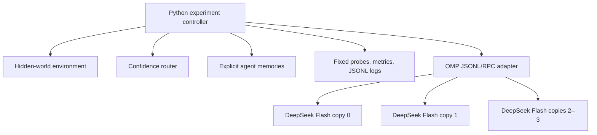

# Emergent Specialization

This repository is a controlled pilot for a narrow question: can initially
homogeneous LLM agents develop persistent, useful task differentiation solely
from asymmetric feedback histories? The complete scientific design, controls,
and methodological cautions are in [Emergent Specialization.md](Emergent%20Specialization.md).



Codex is the development agent for this repository; it is not an experimental
agent. OMP is only an inference harness for copies of
`deepseek/deepseek-v4-flash`. Python owns identities, sampling, hidden rules,
routing, feedback, memory, checkpoints, random seeds, and all measurements.

## Setup

Requires Python 3.11+ and [uv](https://docs.astral.sh/uv/).

```bash
uv sync
```

`uv sync` creates/updates the project environment and lockfile. No manual
`.venv` activation is needed; prefix project commands with `uv run`.

Check the installed OMP without printing credentials:

```bash
command -v omp
omp --version
omp --help
```

The requested model ID is declared in every real-run config. The harness never
silently substitutes another model.

## Run and test

Run the automated test suite (it never contacts DeepSeek):

```bash
uv run python -m unittest discover -s tests -v
```

Run the complete loop with the deterministic fake backend, without any model
calls:

```bash
uv run python -m emergent_specialization.experiment --config configs/pilot_private.yaml --dry-run
```

After confirming the local OMP runtime and model availability, run a 20-round
pilot under private feedback:

```bash
uv run python -m emergent_specialization.experiment --config configs/pilot_private.yaml
```

The shared-memory control is identical except for its feedback condition:

```bash
uv run python -m emergent_specialization.experiment --config configs/pilot_shared.yaml
```

The 20-round pilots make **400** DeepSeek calls each: 20 interaction rounds ×
4 agents (80), plus 40 fixed probes × 4 agents at checkpoints 0 and 20 (320).
They are intentionally not launched automatically.

Use `--num-rounds 10` and `--seed 2` for non-persistent overrides.

## Experimental controls

- Four agents begin with an identical model ID, system prompt, decoding intent,
  empty memory, and tool access. Agent IDs live only in Python and are not
  inserted into model prompts.
- The four modular rules are environment-only. Prompts provide only an opaque
  world label, `x`, `y`, and answer choices.
- Every OMP completion starts a new process using `--mode rpc --no-session`.
  The adapter also passes `--no-tools --no-skills --no-rules --no-extensions
  --no-lsp --no-pty`. Thus OMP conversation history, compaction, tools, and
  project memory do not act as scientific memory.
- The only model-visible history is an explicit list of selected feedback
  experiences. The baseline uses `recent_k: 8`, giving every agent the same
  context budget. Probe evaluation receives frozen snapshots and cannot update
  memory.
- OMP 17.2.10 documents model and thinking controls in its CLI/RPC interface,
  but not temperature, top-p, or max-tokens controls. Those fields are logged
  as experimental intent and are not falsely claimed as enforced by OMP.
- A no-prompt local OMP smoke test did emit an `autoresearch` extension UI
  widget even with `--no-extensions`. It is not a model tool under
  `--no-tools`, but should be audited or disabled in the OMP installation
  before treating a real run as a completely feature-free baseline.

## Outputs

Each run creates `data/runs/<run-id>/` containing:

- `metadata.json`: config, hashes, runtime and backend metadata;
- `events.jsonl`: every inference attempt, parse failure/retry, round, and
  checkpoint event;
- `metrics.jsonl`: checkpoint behavioral matrices and derived metrics;
- `summary.json`: final routing, memory counts, and metrics.

Raw JSONL is the scientific record. It intentionally stores tasks, the exact
memory inserted into each prompt, prompt hashes, raw responses, parsed values,
latency, and errors—but never credentials. Derived checkpoint metrics include
individual/per-domain accuracy, utilization entropy, task-agent mutual
information, oracle gain, cosine behavioral distance, exact single-linkage HSE,
and normalized variants. Routing robustness remains a future extension.
